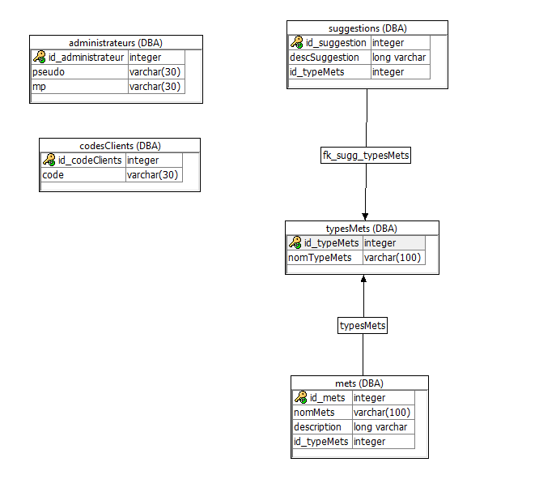

# projet-aout-2020
Site d'un restaurant végétarien

# Description du projet
Le projet est le site d'un restaurant végétarien appelé "vegezek".
Ce site est une vitrine des différentes informations relatives au restaurant (carte, heures d'ouverture, localisation,...).

# Aspects implémentés
-1: Création de l'HTML afin d'afficher une carte reprenant les différents mets que propose le restaurant.
La carte comprend les noms des mets ainsi que pour chacun d'eux une petite description.
Les mets sont répertoriés à l'aide d'un système de tri en fonction de leur type.

-2: Interface de connexion pour les administrateurs.
Les administrateurs peuvent se connecter afin d'ajouter des mets sur la carte et de voir les suggestions faites par les clients.

-3: Interface de modification de la carte.
Les administrateurs peuvent ajouter différents mets sur la carte.

-4: Interface de connexion clients.
Les clients peuvent se connecter à l'aide d'un code clients qu'ils ont au préable reçu lors de leurs visites au restaurant.

-5: Interface de suggestions.
Les clients connectés ont la possibilté de faire des suggestions de mets à ajouter sur la carte,
suggestions qui seront visibles par les administrateurs dans leur interface dédiée.

# Détail api rest
-adminConnexion : permet la connexion des administrateurs à la BDD.
Il ne prend rien en paramètre.
Il récupère les pseudos et mots de passes dans la BBD (type = JSON).

-chargSuggestions : permet de créer un tableau d'objets

-clientConnexion : 

-mets : 

-modifCarte : 

-suggestion : 

-typeMets : 

# Détail DB 
-

# Schéma relationel 

